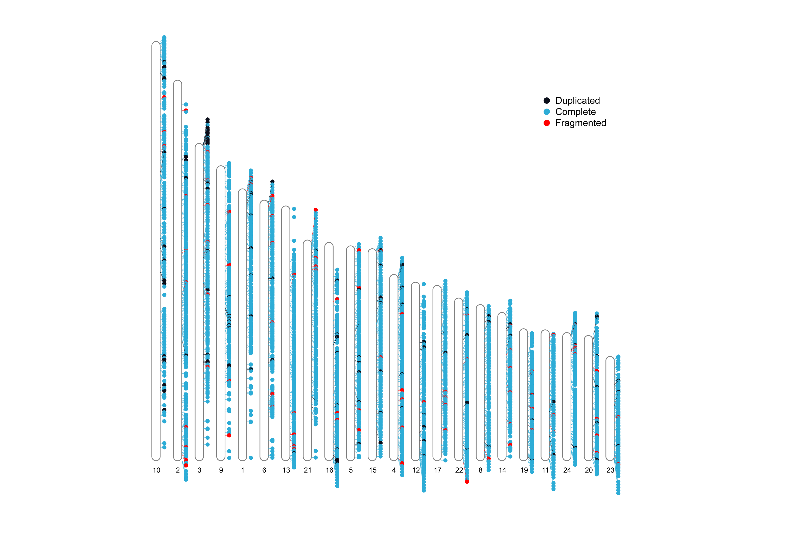
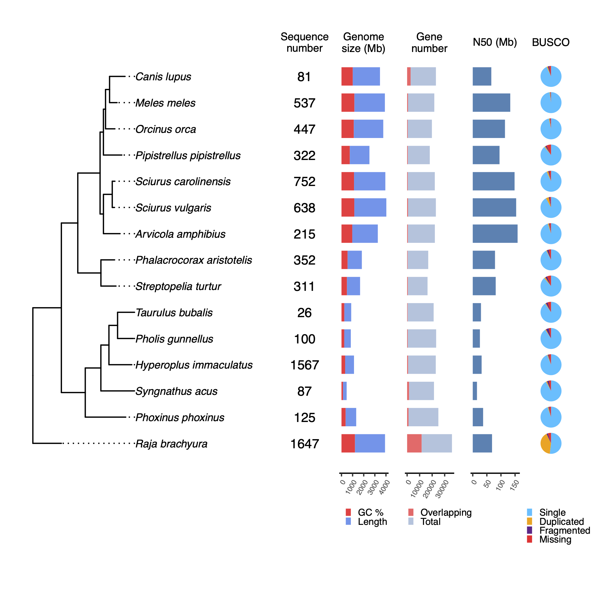

# ecoflow/genomeqc: Output

## Introduction

This document describes the output produced by the pipeline. Most of the plots are taken from the MultiQC report, which summarises results at the end of the pipeline.

The directories listed below will be created in the results directory after the pipeline has finished. All paths are relative to the top-level results directory.

<!-- TODO nf-core: Write this documentation describing your workflow's output -->

## Pipeline overview

The pipeline is built using [Nextflow](https://www.nextflow.io/) and processes data using the following steps:

<!-- [pigz uncompress](#pigz-uncompress) - Uncompresses FASTA and GFF files -->
- [NCBI genome download](#ncbi-genome-download) - Download genomes and their annotations from RefSeq
<!-- [FastaValidator](#fastavalidator) Validate FASTA files -->
- [Quast](#quast) - Genome quality and contiguity -%GC content, N50, N90, number of contigs, etc
- [tidk](#tidk) - Identify telomeric repeats
- [Merqury](#merqury) - Genome completness and accuracy basedon raw sequecing k-mer counts
- [AGAT sp_statistics](#agat-sp_statistics) - Report with gene statistics
<!-- [AGAT convert sp_GXF2GXF]() - Standataizes gff files -->
- [AGAT sp_keep_longest_isoform](#agat-sp_keep_longest_isoform) - Filters longest isoform
- [Gene overlaps](#gene-overlaps) - Finds overlapping genes (sense and antisense)
- [GffRead](#gffread) - Extract longest isoform from FASTA file
- [BUSCO](#busco) - Genome completness based on single copy orthologus markers
- [Orthofinder](#orthofinder) - Phylogenetic orthology inference
- [Tree summary](#tree-summary) - Phylogenetic summary plot
- [MultiQC](#multiqc) - Aggregate report describing results and QC from the whole pipeline
- [Pipeline information](#pipeline-information) - Report metrics generated during the workflow execution

<!--### Pigz Uncompress

pigz is used to uncompress `.gz` input files, as some nf-core/genomeqc modules require uncompressed files as input. -->

### NCBI genome download

[NCBI genome download](https://github.com/kblin/ncbi-genome-download) is a tool for downloading assemlbies from the NCBI FTP site.

In nf-core/genomeqc, it inputs RefSeq IDs and donwloads the respective assembly and annotation. 

Output files

- `ncbigenomedownload/`
  - `<assembly>.fa.gz`: Genome assembly in FASTA format.
  - `<assembly>.gff3.gz`: Annotation in GFF format.

This directory will only be present if `--save_assembly` flag is set.

### Quast

[Quast](https://github.com/ablab/quast) provides different quality metrics about the genome assembly. It evaluates contiguity -N50, N90-, genome size, GC% content and number of sequences.

It generates a report in different formats, as well as an HTML file with in integrated contig viewer.

Output files

- `quast/<species_name>/`
  - `icarus.html`: Contig viewr in HTML format
  - `report.html`: Assembly stats in HTML format
  - `report.pdf`: Assembly stats in tsv format
  - `report.tsv`: Assembly QC as HTML report

### tidk

[tidk](https://github.com/tolkit/telomeric-identifier) is a tool to identify and visualise telomeric repeats from asseblies.

It will use a known telomeric repeat as input string, and will find occurrences of these sequence in windows across the genome.

- `tidk/`
  - `<species_name>.tsv`: Report with the number of repeats found in different number of windows
  - `<species_name>.svg`: Plot with the repeat distribution

To run nf-core/genomeqc with idk, the flag `--run_tidk` must be provided.

### Merqury

[Merqury](https://github.com/marbl/merqury) uses k-mers from sequencing reads to evaluate the assembly quality and completness without the need of a high quality reference.

It generates a histogram relating k-mer counts in the read set to their associated counts in the assembly, as well as a completness report.

Output files

- `merqury/`
  - `<assembly>.html`: Contig viewer in HTML format
  - `<assembly>.html`: Assembly stats in HTML format
  - `<assembly>.pdf`: Assembly stats in tsv format
  - `<assembly>.tsv`: Assembly QC as HTML report

To run nf-core/genomeqc with merqury, the flag `--run_merqury` must be provided.

### AGAT sp_statistics

[AGAT sp_statistics](https://agat.readthedocs.io/en/latest/tools/agat_sp_statistics.html) computes several annotation metrics such as number of genes, transcripts, exons, etc.

Output files

- `agat/`
  - `<species_name>.stats.txt`: Contig viewr in HTML format

### AGAT sp_keep_longest_isoform

[AGAT sp_keep_longest_isoform](https://agat.readthedocs.io/en/latest/tools/agat_sp_keep_longest_isoform.html) filters GFF file to keep the longest isoform per gene. Longest isoforms are recommended as input for both BUSCO and Orthofinder.

Output files

- `longest/`
  - `<species_name>.longest.gff3`: Contig viewr in HTML format

This directory will only be present if `--save_longest_isoform` flag is set.

### Gene overlaps

**Gene overlaps** is a local module based on the R package [GenomicRanges](https://bioconductor.org/packages/release/bioc/html/GenomicRanges.html), used for manipulating genomic intervals. It finds the number of genes that are overlapping in the GFF file, which can be used as a metric to evaluate the quality of the annotation.

It outputs a brief report with information about the number of reads, the number of genes fully contained in sense direction and in the antisense direction, and the total number of overlapping genes.

Output files

- `longest/`
  - `Count.<species_name>.tsv`: Report in tsv format

### GffRead

[GffRead](https://github.com/gpertea/gffread) extracts the protein sequences using the genome assembly and annoation as input.

Output files

- `gffread/`
  - `<species_name>.longest.fasta`: Report in tsv format

This directory will only be present if `--save_extracted_seqs` flag is set.

### BUSCO

[BUSCO](https://busco.ezlab.org/) is a tool for assessing the quality of assemblies based on the presence of single copy orthotologues. It computes the compleness based on evolutionarily informed expectations of gene content, whether this single copy markers are present in single copy, duplicated, fragmented or absent.

It outputs a report with completness stats, and a summarized table with these stats.

Output files

- `busco/`
  - `short_summary.specific.<busco_db>.<species_name>.fasta.txt` Completness report in tsv format
  - `<species_name>-<busco_db-busco.batch_summary.txt`: Summarized completness report in tsv format
  - `<species_name>_lineage.png` Ideogram with the location of single copy markers

### Orthofinder

[Orthofinder](https://github.com/davidemms/OrthoFinder) finds groups of orthologous genes and uses these orthologous genes for phylogenetic inference.

It output a rooted species tree which is later used to present the quality stats of the assemblies.

### Tree summary

**Tree summary** is a local module that takes the rooted trees species from Orthofinder, as well as the ouput statistics from the mentioned tools.

The idea of the tree summary is to give some phylogenetic context to the quality stats, which might help users when evaluating the integrity of the assemblies.

- `tree_summary/`
  - `tree_plot.pdf` Tree summary with quality statistics

### MultiQC

[MultiQC](http://multiqc.info) is a visualization tool that generates a single HTML report summarising all samples in your project. Most of the pipeline QC results are visualised in the report and further statistics are available in the report data directory.

Results generated by MultiQC collate pipeline QC from supported tools e.g. FastQC. The pipeline has special steps which also allow the software versions to be reported in the MultiQC output for future traceability. For more information about how to use MultiQC reports, see <http://multiqc.info>.

Output files

- `multiqc/`
  - `multiqc_report.html`: a standalone HTML file that can be viewed in your web browser.
  - `multiqc_data/`: directory containing parsed statistics from the different tools used in the pipeline.
  - `multiqc_plots/`: directory containing static images from the report in various formats.

### Pipeline information

[Nextflow](https://www.nextflow.io/docs/latest/tracing.html) provides excellent functionality for generating various reports relevant to the running and execution of the pipeline. This will allow you to troubleshoot errors with the running of the pipeline, and also provide you with other information such as launch commands, run times and resource usage.

Output files

- `pipeline_info/`
  - Reports generated by Nextflow: `execution_report.html`, `execution_timeline.html`, `execution_trace.txt` and `pipeline_dag.dot`/`pipeline_dag.svg`.
  - Reports generated by the pipeline: `pipeline_report.html`, `pipeline_report.txt` and `software_versions.yml`. The `pipeline_report*` files will only be present if the `--email` / `--email_on_fail` parameter's are used when running the pipeline.
  - Reformatted samplesheet files used as input to the pipeline: `samplesheet.valid.csv`.
  - Parameters used by the pipeline run: `params.json`.

